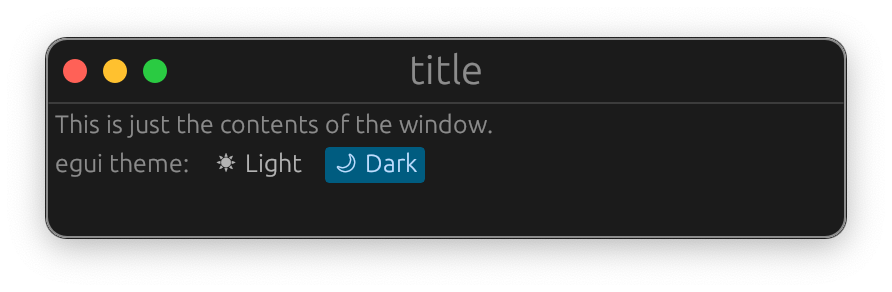

# egui_title_bars.

> *The Title Bar kit*

- [x] macos.
- [ ] linux.
- [ ] window.

## examples.

```rs
use egui_title_bars::CustomTitleBar;

impl eframe::App for MyApp {
  fn update(&mut self, ctx: &egui::Context, _frame: &mut eframe::Frame) {
    let panel_frame = egui::Frame {
      fill: ctx.style().visuals.window_fill(),
      rounding: 10.0.into(),
      stroke: ctx.style().visuals.widgets.noninteractive.fg_stroke,
      outer_margin: 0.5.into(), // so the stroke is within the bounds
      ..Default::default()
    };

    CentralPanel::default().frame(panel_frame).show(ctx, |ui| {
      ui.title_bar("title"); 
    });
  }
}
```

**-macos**

<p align="center">
  
  
</p>

## details.

```rs
TitleBar::default()
  .with_text("title")
  .show_decorations(true)
  .align_decorations(egui::Align::LEFT);
```
